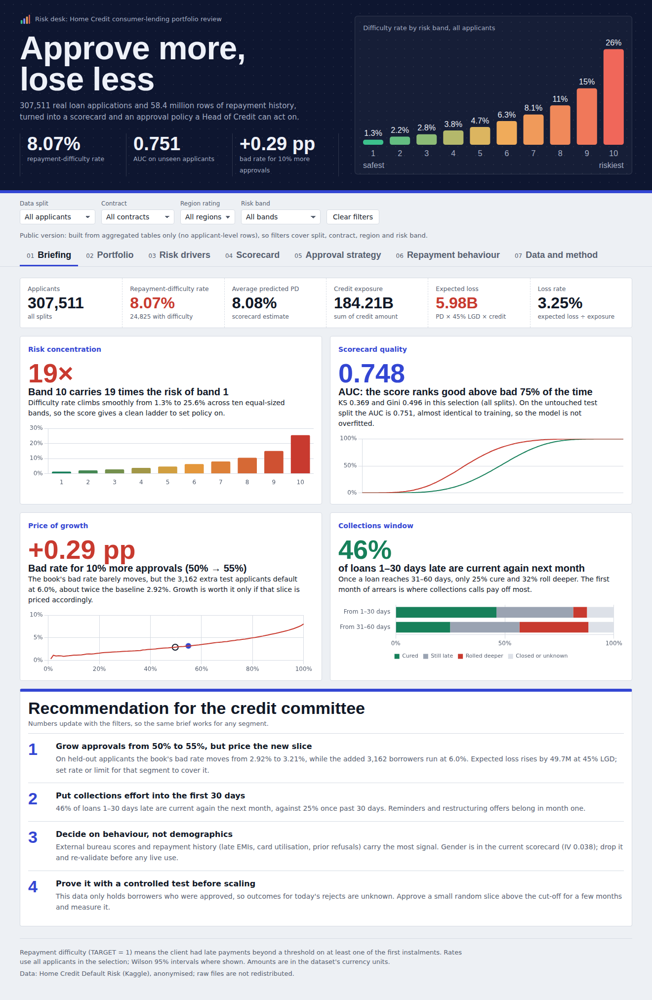
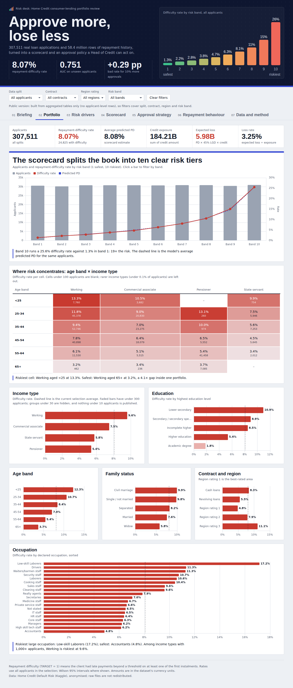
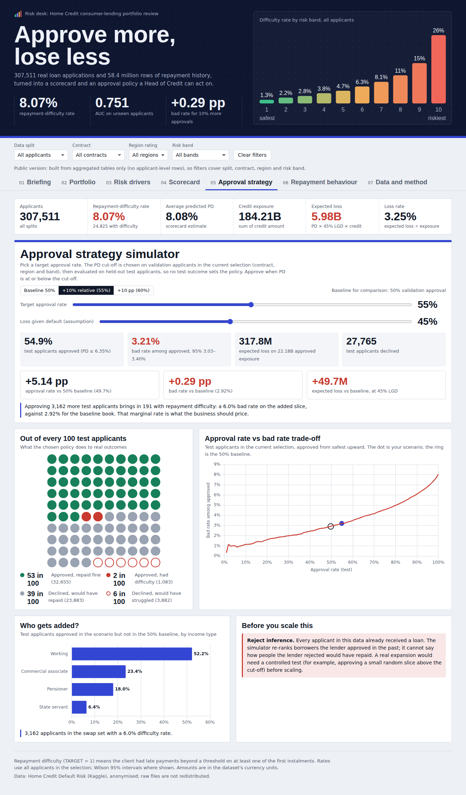
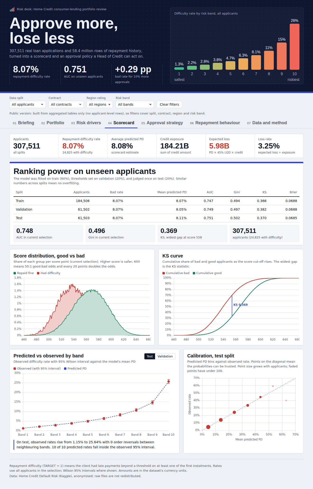
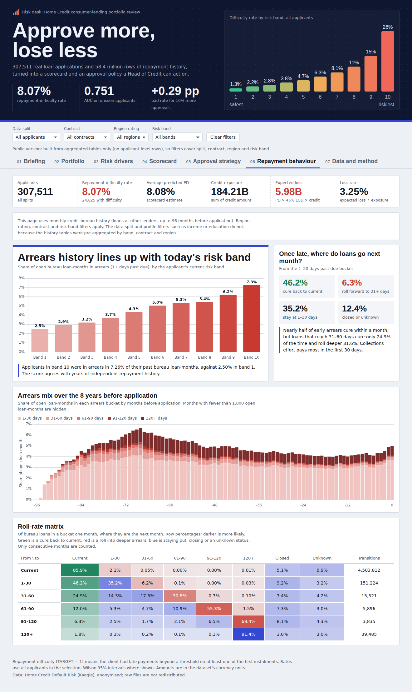

# Home Credit: credit-risk warehouse and scorecard

A complete analytical project using seven Home Credit CSVs: PostgreSQL raw → staging views → intermediate aggregates → star-schema marts → four executed Python notebooks → compact CSV exports → an interactive dashboard.

**Business question (Head of Credit Risk):** can we approve 10% more applicants without pushing the bad rate up by more than 0.5 percentage points, and where should collections focus?



## Key findings

| Finding | Evidence |
|---|---|
| The scorecard ranks risk well on unseen applicants | Test AUC 0.751, Gini 0.502, KS 0.370; train AUC 0.747, so no overfitting |
| Risk is concentrated in the top bands | Band 10 difficulty rate 25.6% vs 1.3% in band 1; zero band-order reversals on test |
| Growth is affordable but has a marginal price | 50% → 55% approval moves test bad rate 2.92% → 3.21% (+0.29 pp); the extra slice runs at about 6.0% |
| The first month of arrears is the collections window | 46% of bureau loans 1–30 days late are current next month, against about 25% once past 30 days |
| Behaviour beats demographics | External scores (IV 0.30, 0.28) and repayment history carry the most signal |

## Dashboard

Open [`dashboard/index.html`](dashboard/index.html) in a browser (internet needed for the chart library and fonts). Seven pages: briefing, portfolio, risk drivers, scorecard, approval-strategy simulator, repayment behaviour, data and method. Filters: data split, contract, region rating and risk band; the simulator also takes a target approval rate and an LGD assumption.

The committed dashboard embeds **aggregated tables only**: no applicant-level rows, and any published cell with fewer than 10 applicants is suppressed. Rebuild it after a pipeline run with:

```bash
python dashboard/build_dashboard.py
```

| | |
|---|---|
|  |  |
|  |  |

## Data and licence

The data are from the [Home Credit Default Risk](https://www.kaggle.com/competitions/home-credit-default-risk/data) Kaggle competition, whose rules restrict redistribution. **This repository contains no raw or applicant-level data.** Download the CSVs from Kaggle yourself (accept the competition rules first). Applicant-level outputs (`fact_application.csv`, `applicant_features.csv`, `scored_applications.csv`) are produced locally and are git-ignored. Only aggregated results, code and documentation are committed. This is non-commercial portfolio work.

## Known issue and next step

The current scorecard selects `gender` as one of its 25 features (IV 0.038). Lenders generally exclude protected attributes from credit decisions. Next step: drop it, refit, and report the change in AUC and band calibration.

**Open the actual results:** [run report](runs/real/run_report.md), [analysis findings](runs/real/analysis/findings.md), [executed notebooks](runs/real/notebooks), [CSV exports](runs/real/exports), [execution evidence](runs/real/run_manifest.json).

The original `application_test.csv` is excluded because it has no observed TARGET. The held-out **test split in this project** is 20% of `application_train`; it is not Kaggle's unlabeled competition test file.

## Re-run on this computer

Double-click `run.command`, or run these commands from this folder:

```bash
../.venv-home-credit/bin/python -m src.download_data
../.venv-home-credit/bin/python -u -m src.run_pipeline
```

The runtime has already been installed in the project parent's `.venv-home-credit`. PostgreSQL binaries are installed at `/Library/PostgreSQL/18/bin`; the project creates a separate `homecredit_real` database in `.runtime/pgdata`. It uses the private socket `/private/tmp/homecredit-pg-socket`, port `55438`, role `homecredit`. Existing user databases are untouched. `homecredit_synthetic` contains only deterministic test fixtures. Source CSVs and the local database remain on this machine and are excluded from the portable archive.

For a fresh machine:

```bash
python3 -m venv .venv
source .venv/bin/activate
python -m pip install -r requirements.txt
# Install PostgreSQL from its official distribution and set PG_BIN if needed.
python -m src.download_data
python -u -m src.run_pipeline
```

Use an existing **dedicated project database** with `DATABASE_URL` or `--dsn`. Set `PG_BIN` to the PostgreSQL `bin` directory if its binaries are not on PATH. The runner never records the connection string in its result files. Raw imports resume only when the file SHA-256 and loaded row counts match. SQL and model outputs are rebuilt on a normal re-run; matching notebook outputs reuse the already fitted analysis. `--reload` replaces only this project's raw tables and derived schemas, so use it only in the dedicated database.

```bash
python -m src.run_pipeline --data-dir /path/to/csvs --output-dir runs/real
python -m src.run_pipeline --stop-after raw
python -m src.run_pipeline --synthetic
python -m src.run_pipeline --lgd 0.60
```

The LGD change is a scenario assumption. Approval strategy uses an illustrative 50% validation approval baseline; it exports both 55% (10% more approvals **relative**) and 60% (10 percentage points more).

## Pipeline and important decisions

| Layer | Outputs | Meaning |
|---|---|---|
| Raw | Seven `raw.*` tables; generated DDL and SHA-256 evidence | Original columns, sentinels, categories and all source rows; no cleaning or removal |
| Quality | `audit.dq_results` and `dq_results.csv` | Every column's null percentage, entity keys, cohort/parent absence, sentinels, placeholders, amount/age ranges, EMI duplication and conflicting snapshots |
| Staging | Seven views | Explicit numeric casts, readable names, age/employment years, ratios, category cleaning and quality flags |
| Intermediate | EMI → prior loan → applicant; bureau/POS/card month → loan → applicant | Grain is enforced with unique indexes and assertions; only train-cohort history observable at day/month zero is used |
| Marts | Application fact, four dimensions, monthly detail and roll counts | One application row per applicant; scoring plus current profile, contract, region and risk-band keys |
| Python | Four notebooks and saved WoE logistic scorecard | EDA, drivers, model performance/calibration and approval strategy |
| Exports | Compact final marts CSVs | Monthly and roll details are aggregated for import size; full loan/month detail stays in PostgreSQL |

`generate_ddl.py` samples 2,000 rows and reads the complete header, so the 122-column application table is generated automatically. Integral identifiers use BIGINT; fractional values use unconstrained NUMERIC, without floating-point rounding or a fixed money scale. CSV missing values become SQL NULL. The original files are retained as the byte-level reference. Sample inference cannot prove unseen values: a failed type inference retries the complete table losslessly as TEXT and records that fact, rather than skipping rows. Numeric corruption in required analytic fields remains a visible failure needing explicit repair; the real seven-file run did not need the fallback.

The seven expected counts are:

| CSV | Expected rows |
|---|---:|
| application_train | 307,511 |
| previous_application | 1,670,214 |
| installments_payments | 13,605,401 |
| POS_CASH_balance | 10,001,358 |
| credit_card_balance | 3,840,312 |
| bureau | 1,716,428 |
| bureau_balance | 27,299,925 |

Raw histories include applicants outside `application_train`. They are retained in raw and audited as outside the labelled analysis cohort, then excluded through existence filters. This is distinct from a genuinely absent prior-loan parent or contradictory loan ownership.

**Partial payments:** an EMI is keyed by applicant + previous loan + installment version + installment number. The scheduled amount is counted once; same-day payment amounts are combined before the running cumulative sum. Settlement occurs when cumulative payments first cover the scheduled amount within a 0.01 currency-unit tolerance. A 50-unit early payment and 50-unit late payment on a 100-unit EMI settle on the second payment date. Missing payments stay flagged; underpaid EMIs remain unsettled. Their days late are a **censored lower bound at day zero**, not a known final repayment delay. Positive payment dates are excluded from history features.

Conflicting EMI schedules use the earliest valid due date and largest scheduled amount, with conflict flags. Exact duplicate source payment rows are audited and retained because the extract does not identify whether identical rows are separate payments; their possible effect is an explicit limitation. Duplicate loan/month snapshots use conservative maximum DPD rather than summing repeated balances.

Bureau codes map `C` → Closed, `X`/unexpected → Unknown, `0` → Current, and `1`…`5` → 1–30, 31–60, 61–90, 91–120, 120+ DPD. `bureau_months_31plus` means definitely **over 30** days overdue. Exactly 30 days cannot be identified inside the 1–30 bucket. Closed and Unknown have NULL numerical DPD, never an invented zero.

Roll rates use chronological `LAG()` by bureau loan and require a month difference of exactly one. A gap is excluded from a one-month transition. The denominator is all observed transitions from the same source bucket and segment. Re-aggregate counts when changing filters; do not sum or average exported roll percentages.

See [feature dictionary](docs/feature_dictionary.md) for every history feature and quality policy.

## Model and strategy

The deterministic applicant split is 60% training, 20% validation and 20% test. Only training data fit numeric clipping/quantile bins, rare-category handling, WoE mappings, IV feature selection and logistic coefficients. Validation **predictions** define risk-band boundaries and approval thresholds. Test outcomes evaluate the fixed model and policies.

WoE is `ln(good distribution / bad distribution)` with 0.5 smoothing. Logistic odds ratios describe a +1 WoE change, not a one-year or one-currency-unit change. The score uses base 600 at good:bad odds 50:1, with 20 points doubling those odds; **higher scores are safer**. AUC, KS, Gini, Brier score, calibration tables and Wilson intervals are exported.

Risk bands 1–10 ascend in predicted PD. Observed validation/test rates are checked for monotonicity and any reversal is reported. The pipeline never reorders bands using test outcomes or silently forces a monotonic observed result. Inspect actual rates, counts and confidence intervals in `risk_bands.csv`.

Expected loss is an illustrative `PD × LGD × EAD` scenario. LGD defaults to 45%; current credit amount is the EAD proxy. TARGET describes repayment difficulty, not measured accounting loss. The source does not provide recovery/loss data to estimate LGD. Missing EAD gives missing applicant expected loss and is excluded from portfolio sums.

**Reject inference:** current rejected applicants do not have observed outcomes in this labelled cohort. These strategies retrospectively re-rank observed borrowers; they cannot establish the outcome of approving previously rejected people. Previous refused applications are history features, not observed outcomes for rejected current applications. This is a central interview limitation, not a step where fabricated rejection labels are added.

Additional limits: there is no usable current-application calendar here for temporal validation; currency codes in bureau lack FX metadata, so summed bureau amounts assume comparable reporting units; sparse chi-square expected cells are flagged, p-values use Benjamini–Hochberg correction, and effect sizes are reported. Associations are not causal effects.

## Import-ready files and grains

| CSV | Grain |
|---|---|
| fact_application.csv | One labelled applicant, with dimensions, all history features, split, PD, score, risk band and scenario expected loss |
| dim_profile.csv | Income type × education × family status × age band |
| dim_contract.csv | Contract type |
| dim_region_rating.csv | Region rating × city rating; zero codes missing/invalid |
| dim_risk_band.csv | Bands 1–10; validation and held-out test rates are separately labelled |
| agg_repayment_monthly.csv | Relative month × DPD bucket × current risk band × contract × region |
| fact_roll_rate.csv | Consecutive relative month × from/to bucket × current risk band × contract × region; counts and denominators |
| cutoff_table.csv | Disconnected strategy thresholds selected on validation, evaluated separately on validation and test |
| risk_band_metrics.csv | Split × risk band, with counts, rate intervals and monotonicity audit |

`applicant_features.csv` is the internal model input. `dq_results.csv`, `history_exclusions.csv` and `data_dictionary.csv` are supporting evidence. Monthly distinct applicant counts are **not additive** across months or buckets. Historical segments use the current application score, not a score that was available at the historic month.

## Verification

The full real execution status and table counts are recorded in `runs/real/run_manifest.json`. The independent synthetic fixture tests exercise partial payments, version separation, settlement timing, missing/future payments, ownership contradictions, duplicate snapshots, empty histories, roll gaps, star keys and invalid scores. Analytics tests check unseen categories, score direction, fixed strategy thresholds and that perturbing held-out features cannot change the fitted training model.

```bash
python -m src.run_pipeline --synthetic
TEST_DATABASE_DSN='host=/private/tmp/homecredit-pg-socket port=55438 user=homecredit dbname=homecredit_synthetic' python -m pytest tests -q
```

To stop the project database after use:

```bash
/Library/PostgreSQL/18/bin/pg_ctl -D .runtime/pgdata stop
```

## Source and reproducibility

Official dataset description: [Home Credit Default Risk](https://www.kaggle.com/competitions/home-credit-default-risk/data). Data were downloaded from the public [Kaggle mirror by Megan Crenshaw](https://www.kaggle.com/datasets/megancrenshaw/home-credit-default-risk), version 2, and checked against all seven expected counts. `data/source.json` and the raw-import manifest record provenance and SHA-256 hashes. Original competition provenance and applicable source terms remain with the data; raw CSVs are not redistributed in the portable archive.

Technical references: [PostgreSQL COPY](https://www.postgresql.org/docs/current/sql-copy.html), [exact numeric types](https://www.postgresql.org/docs/current/datatype-numeric.html), [logistic regression](https://scikit-learn.org/stable/modules/generated/sklearn.linear_model.LogisticRegression.html), and [probability calibration](https://scikit-learn.org/stable/modules/calibration.html). `requirements.lock.txt` records the exact libraries used in the verified run.
